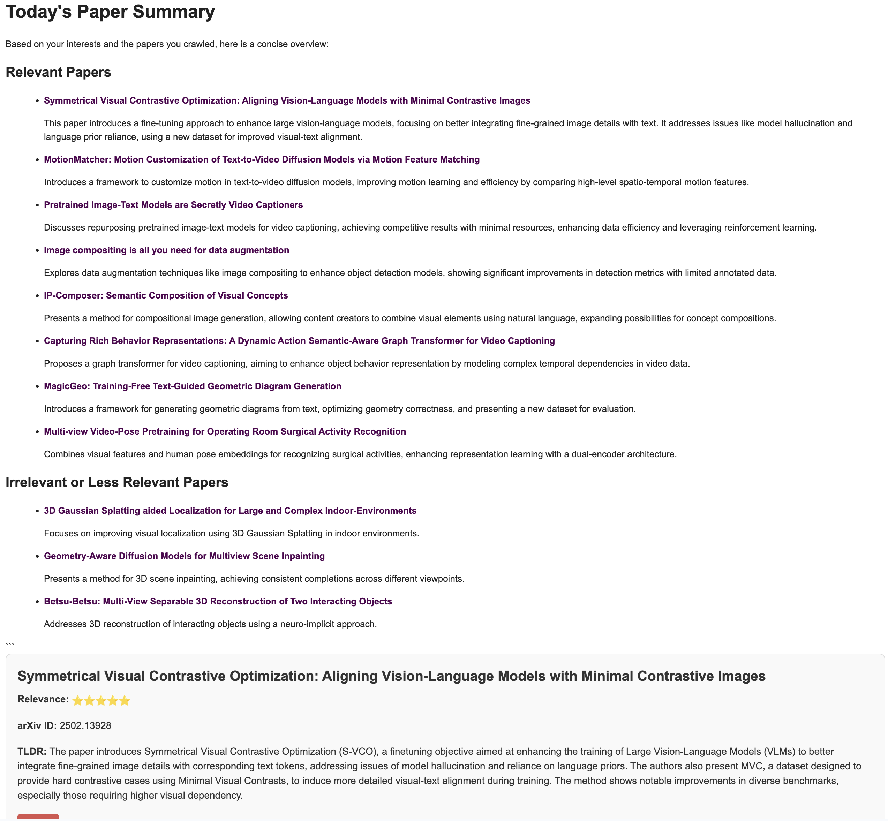
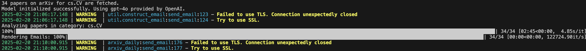
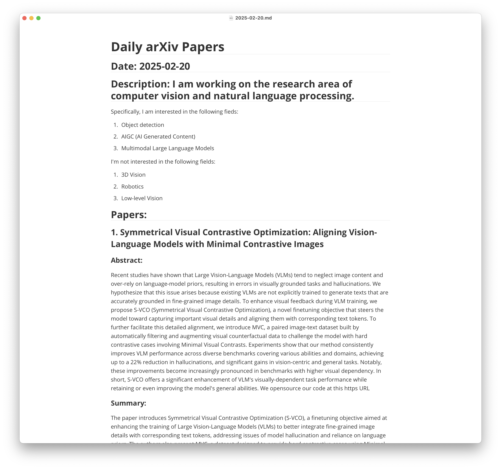

<h3 align="center">Customize-arXiv-Daily</h3>

---

<p align="center"> Recommend new arxiv papers of your interest daily according to your customized description.
    <br> 
</p>

> [!NOTE]
> This repo borrow the idea and some functions from [zotero-arxiv-daily](https://github.com/TideDra/zotero-arxiv-daily). Thanks for their great work!😊

## 🧐 Why I create this project <a name = "about"></a>
- During the use of [zotero-arxiv-daily](https://github.com/TideDra/zotero-arxiv-daily), I often find that the recommendation process didn't run in the way that I want. Since my study area has shifted, my Zotero include some papers that I'm not interested in anymore.
- For those who **do not use zotero as PDF reader**, get customized arxiv recommendation is still needed.
- For those that want to **set their own prompt** to guide LLM during paper selection and recommendation.
- For those who want to leverage convenient local deployment tools, like **Ollama**

## ✨ Key Features Compared with [zotero-arxiv-daily](https://github.com/TideDra/zotero-arxiv-daily)
- Fully customized LLM prompt to guide your paper recommendation process.
- Ready-to-use leverage of recent models, include DeepSeek-R1/V3/... 
- Use Ollama to accelerate local deployment.
- Save your arXiv recommendation history.
- Summarize and recommend papers to you at the start of the email.

## 📷 Screenshot


## 🚀 Usage
### Quick Start
1. Run `git clone https://github.com/JoeLeelyf/customize-arxiv-daily.git`
2. Run `pip install -r requirements.txt` to install necessary packages.
3. Get your STMP server. Common STMP service provider include [QQ mail box](https://service.mail.qq.com/detail/0/427)
4. Describe the research fields you're interested in, and the fields you're not. Edit the `description.txt`. For, example:
```txt
I am working on the research area of computer vision. 
Specifically, I am interested in the following fieds:
1. Object detection
2. AIGC (AI Generated Content)
3. Multimodal Large Language Models

I'm not interested in the following fields:
1. 3D Vision
2. Robotics
3. Low-level Vision
```
5. Configure your own `arXiv catergories`, `api_key` and `models`. The repo currently support any api in OpenAI api form, and various models in Ollama. Meaning of different parameters:
    - `--categories`: arXiv categories that you are interested in, like `cs.CV` `cs.AI`
    - `--sender`: E-mail address that provide SMTP service, like, `123456@qq.com`
    - `--receiver`: The e-mails address that you want to receive your notice, like, `my_gmail@gmail.com`
    - `--save`: store_true, whether to save the arXiv results to local markdown files.

- `main_gpt.sh`: Visit [OpenAI](https://openai.com/) to get a OpenAI api_key invole GPT models. 
```bash
python main.py --categories cs.CV cs.AI \
    --provider OpenAI --model gpt-4o \
    --base_url https://api.openai.com/v1 --api_key * \
    --smtp_server smtp.qq.com --smtp_port 465 \
    --sender * --receiver * \
    --sender_password * \
    --save
```
- `main_silicon_flow.sh`: Visit [SiliconFlow](https://siliconflow.cn/zh-cn/) to get a SiliconFlow api_key for DeepSeek models and more.
```bash
python main.py --categories cs.CV cs.AI\
    --provider SiliconFlow --model deepseek-ai/DeepSeek-R1-Distill-Llama-70B \
    --base_url https://api.siliconflow.cn/v1 --api_key * \
    --smtp_server smtp.qq.com --smtp_port 465 \
    --sender * --receiver * \
    --sender_password * \
    --save
```
- `main_ollama.sh`: Visit [Ollama](https://ollama.com/) for local deployment.
```bash
python main.py --categories cs.CV cs.AI\
    --provider Ollama --model deepseek-r1:7b \
    --smtp_server smtp.qq.com --smtp_port 465 \
    --sender * --receiver * \
    --sender_password * \
    --save
```


6. Choose to run one of the following command in your CLI.
```
bash main_gpt.sh
bash main_silicon_flow.sh
bash main_ollama.sh
```

7. \* Run automatically everyday. For example, use `crontab` on Linux to run the script periodically:
- Edit `crontab` file:
```bash
crontab -e    
```
- Add following line and run the script in 5:00 AM everyday (anytime you want):
```txt
* 5 * * * /path/to/customize-arxiv-daily/main_gpt.sh
```

8. \* Adjust and customize your LLM prompt. Edit `def get_response(self, title, abstract):` func in `arxiv_daily.py`


## Results
### Running process in your CLI


### Markdown saved


### E-mail received


## 📖 How it works
- `util/request.py` crawls the arXiv web page given your provided arXiv categories.
- `arxiv_daily` will call LLM api to summarize every paper and get the relevance score.
- `util/construct_email.py` construct the content of the email in HTML form and send it using SMTP service.

## 📌 Limitations
- The recommendation process of LLM is unstable and the relevance score provided by different LLMs varies a lot.

## ❤️ Acknowledgement
- [zotero-arxiv-daily](https://github.com/TideDra/zotero-arxiv-daily)
